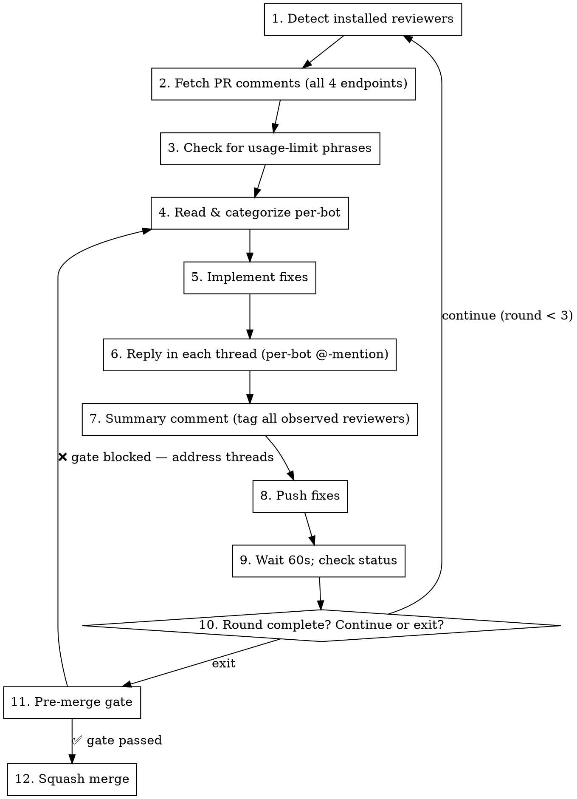

# Multi-Agent Bounded PR-Review Implementation Plan (TT-367)

> **For agentic workers:** REQUIRED SUB-SKILL: Use superpowers:subagent-driven-development (recommended) or superpowers:executing-plans to implement this plan task-by-task. Steps use checkbox (`- [ ]`) syntax for tracking.

**Goal:** Enhance `davidshaevel-claude-toolkit`'s `resolve-code-review` skill to codify the bounded multi-agent PR-review protocol (3-round cap, 60s polling, per-bot @-mentions, auto-detected reviewers, generalized reviewer-exhausted escalation) and establish the `PERMISSIONS.md` pattern for YOLO-mode skill execution.

**Architecture:** Four artifacts under `skills/resolve-code-review/`: `SKILL.md` (agent procedure, refactored to embed bounded-loop semantics), `WORKFLOW.md` (canonical human-facing reference for protocol rationale + per-reviewer config table), `scripts/pr-bot-status.sh` (bash gh-api wrapper, generalized from CareLogue's hardcoded version into a repo-agnostic detector), and `PERMISSIONS.md` (required `Bash(...)` allow patterns + merge instructions + YOLO-mode validation procedure). Plugin version bumps to 1.4.0 (feature add).

**Tech Stack:** Bash, jq, gh CLI, shellcheck (lint), Claude Code Plugin System (SKILL.md format)

**Spec:** `docs/superpowers/specs/2026-05-13-multi-agent-pr-review-design.md` (this repo; sourced from `development-tooling-2026-q2@ab14eff`)

**Linear issue:** [TT-367](https://linear.app/davidshaevel-dot-com/issue/TT-367) — blocks TT-301 + TT-365

**Testing note (read before starting):** This is a docs + bash plugin with no existing test infrastructure. Strict unit-TDD doesn't apply for markdown files (SKILL.md, WORKFLOW.md, PERMISSIONS.md). Verification for those = self-consistency review (each artifact references the others without dangling pointers; the bounded-loop semantics in SKILL.md match the rationale in WORKFLOW.md). For `pr-bot-status.sh`, the test plan is: (1) `shellcheck` for static lint, (2) manual smoke test against this repo's existing closed PR #4 to confirm output shape. End-to-end "skill correctly executes the loop on a real test PR" is the acceptance criterion for **TT-301**, not TT-367 — it requires the install to happen in the consuming repo and lives in TT-301's AC #4.

---

## File Structure

| File | Action | Responsibility |
|------|--------|---------------|
| `skills/resolve-code-review/WORKFLOW.md` | Create | Canonical human-facing reference: 3-round-cap rationale, polling-cadence reasoning, escalation framework, per-reviewer config table (Gemini + Codex + Qodo), manual API reference. Replaces what CareLogue's per-repo workflow doc tried to be. |
| `skills/resolve-code-review/scripts/pr-bot-status.sh` | Create | Bash gh-api wrapper. Two modes: pre-merge thread-state check (exits 2 if unaddressed threads exist) + idle wake-up new-activity check. Generalized from CareLogue: auto-detects repo via `gh repo view`; reviewer list from env var with sensible defaults; usage-limit phrases from env var. |
| `skills/resolve-code-review/PERMISSIONS.md` | Create | Required `Bash(...)` allow patterns + per-pattern rationale + manual merge instructions for consuming repo's `.claude/settings.local.json` + YOLO-mode validation procedure. Establishes the per-skill PERMISSIONS.md pattern. |
| `skills/resolve-code-review/SKILL.md` | Modify | Refactor to embed bounded-loop procedure: 3-round cap, 60s polling, auto-detect reviewers from PR comments, per-bot @-mentions, summary tagged to all observed reviewers, reviewer-exhausted escalation framework. References WORKFLOW.md, scripts/pr-bot-status.sh, PERMISSIONS.md. |
| `.claude-plugin/plugin.json` | Modify | Version bump 1.3.1 → 1.4.0 (feature add) |
| `.claude-plugin/marketplace.json` | Modify | Version bump 1.3.1 → 1.4.0 (feature add) |
| `README.md` | Modify (conditional) | If it lists per-skill files, add the 3 new artifacts under resolve-code-review. Inspect first; skip if irrelevant. |
| `CLAUDE.md` | Modify (conditional) | If it documents skill structure, add the 3 new artifacts. Inspect first; skip if irrelevant. |

**Commit plan (5 commits on the branch before PR):**
1. `WORKFLOW.md` (foundational reference; other files cite it)
2. `scripts/pr-bot-status.sh` (after WORKFLOW.md so it can cite §4 of the workflow)
3. `PERMISSIONS.md` (after script exists so it can enumerate the script's allow patterns)
4. `SKILL.md` refactor (after the above three since SKILL.md references all of them)
5. Version bump + (conditional) README/CLAUDE.md updates

---

### Task 1: Verify worktree state and dependency tooling

**Files:** (read-only inspection)

- [ ] **Step 1: Confirm cwd is the feature worktree**

Run: `pwd`

Expected: `/Users/dshaevel/workspace-ds/davidshaevel-marketplace/tt-367-multi-agent-pr-review`

If not, `cd` there.

- [ ] **Step 2: Confirm branch and clean state**

Run: `git status && git branch --show-current`

Expected:
- Branch: `claude/tt-367-multi-agent-pr-review`
- Working tree clean (the spec import at `df24244` is already on the branch)

- [ ] **Step 3: Verify gh CLI is authenticated and jq is installed**

Run: `gh auth status && jq --version`

Expected:
- gh: `Logged in to github.com account dshaevel`
- jq: a version string (e.g., `jq-1.7.1`)

If gh is not authenticated, run `gh auth login` interactively and re-verify. If jq is missing, `brew install jq`.

- [ ] **Step 4: Verify shellcheck is installed (lint for pr-bot-status.sh)**

Run: `shellcheck --version`

Expected: a version string (e.g., `ShellCheck - shell script analysis tool / version: 0.10.0`)

If missing: `brew install shellcheck`. shellcheck is used only at Task 6 step 2; install it now to avoid mid-task surprises.

- [ ] **Step 5: Inspect README.md and CLAUDE.md for resolve-code-review references**

Run: `grep -n "resolve-code-review" README.md CLAUDE.md`

Expected: some hits. Record the line numbers — you'll consult them at Task 9 to decide whether to update those files. If no hits, Task 9's README/CLAUDE updates can be skipped.

- [ ] **Step 6: Inspect the existing SKILL.md to know what you're refactoring**

Run: `wc -l skills/resolve-code-review/SKILL.md && head -20 skills/resolve-code-review/SKILL.md`

Expected: ~164 lines, frontmatter with `name: resolve-code-review` and `description:`, then a "Resolve Code Review" heading. This is the file you'll rewrite in Task 7.

---

### Task 2: Create skills/resolve-code-review/WORKFLOW.md

**Files:**
- Create: `skills/resolve-code-review/WORKFLOW.md`

This is the canonical human-facing reference. It will be cited by SKILL.md, by pr-bot-status.sh inline comments, and by consuming repos that previously kept their own per-repo workflow docs (CareLogue_App will retire most of `docs/CareLogue_PR_Review_Workflow_v1_2026-05-07.md` once this lands).

- [ ] **Step 1: Create the file with full content**

Write the file with the exact content below. The structure mirrors CareLogue's workflow doc §§1–6 but generalized (no CareLogue-specific paths, no `tinacup77` references, supports N reviewers not just 2).

```markdown
# resolve-code-review Workflow Reference

**Status:** Canonical reference for the bounded multi-agent PR-review protocol applied by the `resolve-code-review` skill.

**Audience:** Engineers and agents using `resolve-code-review` on any repo that has multiple AI PR reviewers installed.

**Procedure for agents:** see `SKILL.md` in this directory. That file is the bounded execution script. This file is the **why** — round-cap rationale, polling-cadence reasoning, escalation framework, per-reviewer config table.

---

## 1. The bounded review loop

A "review round" is one complete cycle of:

1. **Push** — the branch is at a state ready for review (initial push, or a commit addressing prior feedback)
2. **Wait for bots** — installed PR-review bots post inline comments + review summary within ~60–120s of push
3. **Run `resolve-code-review`** — the skill reads every inline comment from each reviewer, categorizes by severity, applies fixes, replies in each thread with `@bot-handle` prefix, pushes the fix commit, posts a summary comment tagging all observed reviewers
4. **Wait for acknowledgement** — give the bots ~60–120s to re-review and either mark threads resolved (LGTM) or post follow-up comments

After step 4, **count the round**. If round count is below the cap, return to step 1 with any new feedback. If the cap is reached, exit the loop.

## 2. Round cap

**Maximum: 3 review rounds per PR. Locked, not configurable.**

Why 3:
- Round 1 — initial push, first batch of feedback, first batch of fixes
- Round 2 — bots re-review the fixes, may find more issues, those get addressed
- Round 3 — final pass, mostly catches things missed; almost always converges

If a PR doesn't converge after 3 rounds, one of these is true:
- The PR is **too large** (split it)
- The PR has **fundamental disagreement** with reviewer feedback (escalate to a human)
- The PR is **stylistic-only feedback** that's not blocking (decline + merge)

Per-PR overrides are intentionally not supported. The cap is the rigor.

## 3. Polling cadence

**Locked at 60 seconds.** Do not deviate.

Reasoning:
- The Anthropic prompt cache TTL is 5 minutes — 60s sleeps keep the cache warm
- Most bots respond within 60–120s; per-bot tracking, idle-window logic, and the 3-round cap (not interval tuning) provide the rigor
- 60s is the runtime floor for `ScheduleWakeup` (clamped `[60, 3600]`)
- Locking removes a knob — agents and humans default to the same cadence

If a bot is silent across 4+ idle wake-ups, that's a signal to escalate (see §6), not to bump the interval.

## 4. Per-reviewer config table

| Reviewer | Bot user | Mention | Severity taxonomy | Usage-limit phrase |
|---|---|---|---|---|
| Gemini Code Assist | `gemini-code-assist[bot]` | `@gemini-code-assist` | CRITICAL / HIGH / MEDIUM / LOW | _(none observed)_ |
| ChatGPT Codex | `chatgpt-codex-connector[bot]` | `@chatgpt-codex-connector` | P0 / P1 / P2 / P3 | `Codex usage limits have been reached` |
| Qodo Merge | `qodo-merge-pro[bot]` | `@qodo-merge-pro` (primary interaction is slash commands `/review` `/improve` `/describe` `/ask` typed directly in PR comments) | v1: Critical / High / Medium / Low. v2: rank 1/2/3 (informational / remediation_recommended / action_required). Confirm during install. | _(observe on first quota event; 30 PRs/month/org free-tier cap)_ |

Qodo's row carries **provisional values** from documentation review on 2026-05-14. Final confirmation happens during the first install (TT-301 in `davidshaevel-dot-com`, TT-365 in `CareLogue-org`).

### How to extend this table

Adding a future reviewer (CodeRabbit, future Anthropic bot, etc.):
1. Append a new row with bot user, mention, severity taxonomy, and any observed usage-limit phrase
2. Add the bot user to the default reviewer list in `scripts/pr-bot-status.sh` (env var `PR_REVIEW_BOTS`)
3. Add the usage-limit phrase to `USAGE_LIMIT_PHRASES` if applicable
4. No SKILL.md change needed — the procedure is reviewer-agnostic

## 5. Severity → action mapping

The skill follows a uniform action rule across severity schemes:

| Severity tier | Action |
|---|---|
| CRITICAL / P0 / rank 3 (action_required) | Always fix |
| HIGH / P1 / Critical (Qodo v1) | Always fix |
| MEDIUM / P2 / High (Qodo v1) / rank 2 (remediation_recommended) | Evaluate; fix if not YAGNI |
| LOW / P3 / Medium-Low (Qodo) / rank 1 (informational) | Skip if stylistic; fix if trivially easy |

When declining, the reply must state the technical reason — not "skipping for now."

## 6. Reviewer-exhausted escalation framework

When `scripts/pr-bot-status.sh` detects any reviewer's usage-limit phrase, the skill **classifies the PR as an escalation case** and surfaces three valid responses without picking one:

1. **Merge on remaining reviewers with explicit human acknowledgement.** Acceptable when (a) the credit-exhausted reviewer is non-critical for this PR, (b) remaining reviewers have signed off, (c) a human has explicitly approved this path. Best for doc-only or low-risk changes.
2. **Top up the exhausted reviewer's credits / upgrade the plan, then retrigger.** Best when the reviewer provides high-value signal and exhaustion is recurring. The retrigger is typically `@bot-handle` mention in a PR comment.
3. **Hold the PR until credits restore.** Best for security-sensitive or production-impacting changes where the missing reviewer's signal is load-bearing.

**The skill never silently converges on surviving reviewers.** Coverage loss is explicit; the user makes the decision per PR.

Special case: a usage-limit-exhausted reviewer may still post a **post-hoc review** at the issue-comments endpoint (Codex does this in response to `@chatgpt-codex-connector` mention). If the post-hoc review is an LGTM-equivalent, it counts as ack — even though the usage-limit notice is still present elsewhere on the PR. Document the decision path in the round summary.

## 7. Per-bot independent tracking

A round is **not** complete until **every** observed reviewer has either:
- Reviewed the latest fix commit (left at least one comment OR an LGTM-style ack), OR
- Stayed silent for ≥2 consecutive 60s wake-ups after a push

If one bot is silent on the latest push while others have acked, **do not declare convergence**. Wait for the silent one.

**Extended-idle exception (4 wake-ups, ~4 minutes):** If one bot has been silent across 4 wake-ups while others have responded, treat as escalation. Either retrigger the silent bot via `@bot-handle` or escalate to a human. Usage-limit phrases are an exception to this exception — if the usage-limit phrase is present, the bot is unavailable, not silent (see §6).

## 8. Thread-level reply tracking

For each inline bot comment, the thread is "addressed" only when:
- A reply from the PR author exists below the bot's most-recent comment in that thread, AND
- The reply references a specific fix commit, AND
- The bot has either acked the reply (LGTM-style) OR stayed silent for ≥2 wake-ups after the reply

A bot's "thank you" / "LGTM" reply counts as ack. A bot posting a NEW comment on the thread counts as continuation (counts toward the next round).

`scripts/pr-bot-status.sh` enforces this rule mechanically via its merge-gate mode: it exits 2 with `MERGE BLOCKED` if any thread lacks an author reply.

## 9. Stale review artifacts

Sometimes a bot flags an issue that was already fixed in the same PR (the bot's `diff_hunk` references the original file addition rather than the current content). To distinguish:

1. Note the `commit_id` field on the comment (the SHA the bot reviewed)
2. Read the file content at that commit: `gh api repos/{owner}/{repo}/contents/{path}?ref={commit_id}`
3. Decode and inspect the relevant lines
4. If the suggested fix is **already in place at that commit** → stale review artifact
5. Reply explaining the artifact, close the thread, do not re-fix

## 10. Pre-merge verification

The canonical safe merge sequence:

```bash
./skills/resolve-code-review/scripts/pr-bot-status.sh <PR_NUMBER> && gh pr merge <PR_NUMBER> --squash
```

The `&&` makes merge contingent on the gate passing. The script exits 0 (`MERGE GATE PASSED`) if every bot thread has an author reply, or 2 (`MERGE BLOCKED`) otherwise. The combined form eliminates the "I ran the check but merged anyway" failure mode.

## 11. Manual API reference (the four sources)

`scripts/pr-bot-status.sh` wraps these; manual calls are rarely needed. Listed for traceability:

1. **Top-level reviews** — `gh api repos/{owner}/{repo}/pulls/{N}/reviews`
2. **Inline comments** — `gh api repos/{owner}/{repo}/pulls/{N}/comments` (line-level; most important source)
3. **Commit-level comments** — `gh api repos/{owner}/{repo}/pulls/{N}/commits/{sha}/comments` (rare)
4. **PR-level discussion comments** — `gh api repos/{owner}/{repo}/issues/{N}/comments` (Codex usage-limit notice and post-hoc reviews land here, not at `pulls/*`)

Always paginate: `--paginate`. The script does this; if you're manual, you must too.

## 12. Reviewer scope

**In scope:** bots installed on the repo that produce inline review comments (Gemini, Codex, Qodo, future bots added to the per-reviewer table).

**Not in scope (treat differently):**
- Human reviewers — pause the loop and surface the comment manually
- Other automated bots (Codecov, Dependabot, etc.) — their pass/fail checks are handled by GitHub status checks, not the bounded loop

## 13. Quick reference

> **3 rounds per PR. 60s polling. All observed reviewers tagged on every reply. Exit on convergence or cap. Escalate on reviewer-exhausted. Squash-merge after gate passes.**
```

- [ ] **Step 2: Verify the file rendered correctly**

Run: `wc -l skills/resolve-code-review/WORKFLOW.md && head -3 skills/resolve-code-review/WORKFLOW.md && tail -3 skills/resolve-code-review/WORKFLOW.md`

Expected: ~155 lines (give or take whitespace); first line is `# resolve-code-review Workflow Reference`; last line ends with `Squash-merge after gate passes.**`.

- [ ] **Step 3: Commit**

```bash
git add skills/resolve-code-review/WORKFLOW.md
git commit -m "feat(resolve-code-review): add WORKFLOW.md canonical reference

Adds the human-facing canonical reference for the bounded multi-agent
PR-review protocol. Covers: 3-round cap rationale, 60s polling locked,
per-reviewer config table (Gemini + Codex + Qodo provisional),
severity→action mapping, generalized reviewer-exhausted escalation
framework, per-bot independent tracking, thread-level reply tracking,
pre-merge verification, and the four API sources.

Generalizes CareLogue's per-repo workflow doc — no CareLogue-specific
paths, supports N reviewers not just 2. Future per-repo workflow docs
shrink to thin pointers + overrides.

Co-Authored-By: Claude Opus 4.7 <noreply@anthropic.com>

related-issues: TT-367"
```

---

### Task 3: Create skills/resolve-code-review/scripts/pr-bot-status.sh

**Files:**
- Create: `skills/resolve-code-review/scripts/pr-bot-status.sh`

Port + generalize CareLogue's `scripts/pr-bot-status.sh` (180 lines). Key generalizations from CareLogue's version:
- **Repo auto-detect** via `gh repo view --json nameWithOwner -q .nameWithOwner` (not hardcoded)
- **Reviewer list** from env var `PR_REVIEW_BOTS` (default: `gemini-code-assist[bot],chatgpt-codex-connector[bot],qodo-merge-pro[bot]`)
- **Usage-limit phrases** from env var `USAGE_LIMIT_PHRASES` (default: `Codex usage limits have been reached`)
- **Workflow doc reference** points to `skills/resolve-code-review/WORKFLOW.md` (the plugin path), not CareLogue's repo path

The two modes (pre-merge gate + idle wake-up) and the merge-gate exit-code semantics (0 = pass, 2 = block) are preserved exactly.

- [ ] **Step 1: Create the script directory**

Run: `mkdir -p skills/resolve-code-review/scripts`

Expected: directory exists silently.

- [ ] **Step 2: Write the script**

Write the file `skills/resolve-code-review/scripts/pr-bot-status.sh` with the exact content below:

```bash
#!/usr/bin/env bash
# pr-bot-status.sh — multi-agent bounded PR-review state detector.
#
# Wraps the four GitHub API sources (pulls/comments, pulls/reviews,
# pulls/commits/<sha>/comments, issues/comments) into a single read-only
# invocation that's safe to allowlist in .claude/settings.local.json.
#
# Generalized from CareLogue's per-repo script: repo auto-detected, reviewer
# list configurable via env var, usage-limit phrases configurable via env
# var. Default reviewers cover Gemini + Codex + Qodo per the per-reviewer
# config table in skills/resolve-code-review/WORKFLOW.md §4.
#
# Usage:
#   ./pr-bot-status.sh <PR_NUMBER>                  # pre-merge: show all bot threads + state (exits 2 if any unaddressed)
#   ./pr-bot-status.sh <PR_NUMBER> <SINCE_COMMIT>   # idle wake-up: show new bot activity since SINCE_COMMIT
#
# Env vars (override defaults):
#   PR_REVIEW_BOTS         comma-separated bot usernames (default: gemini-code-assist[bot],chatgpt-codex-connector[bot],qodo-merge-pro[bot])
#   USAGE_LIMIT_PHRASES    pipe-separated phrases to detect (default: "Codex usage limits have been reached")
#   PR_REVIEW_REPO         override repo auto-detect (format: owner/repo)
#
# Exit codes:
#   0  pre-merge gate passed (all bot threads have author replies) OR idle wake-up completed
#   1  usage error / API error / repo auto-detect failed
#   2  pre-merge gate FAILED (one or more bot threads lack author reply)
#
# See skills/resolve-code-review/WORKFLOW.md §§4, 6, 7, 8, 10 for the protocol
# this script supports.

set -euo pipefail

PR="${1:-}"
SINCE_COMMIT="${2:-}"

if [ -z "$PR" ]; then
  cat >&2 <<'USAGE'
Usage:
  pr-bot-status.sh <PR_NUMBER>                  # pre-merge: all bot threads + state (exits 2 if any unaddressed)
  pr-bot-status.sh <PR_NUMBER> <SINCE_COMMIT>   # idle wake-up: new bot activity since SINCE_COMMIT
USAGE
  exit 1
fi

# --- Repo resolution: PR_REVIEW_REPO env var beats auto-detect ---
REPO="${PR_REVIEW_REPO:-}"
if [ -z "$REPO" ]; then
  REPO=$(gh repo view --json nameWithOwner -q .nameWithOwner 2>/dev/null || true)
fi
if [ -z "$REPO" ]; then
  echo "Error: could not determine repo. Set PR_REVIEW_REPO=owner/repo or run from a repo with gh remote." >&2
  exit 1
fi

# --- Reviewer list: env var → jq array ---
DEFAULT_BOTS="gemini-code-assist[bot],chatgpt-codex-connector[bot],qodo-merge-pro[bot]"
BOTS_CSV="${PR_REVIEW_BOTS:-$DEFAULT_BOTS}"
# Convert "a,b,c" → JSON array ["a","b","c"] for jq
BOTS_JSON=$(printf '%s' "$BOTS_CSV" | jq -R 'split(",") | map(gsub("^\\s+|\\s+$"; ""))')

# --- Usage-limit phrases: pipe-separated, used in jq contains() checks ---
DEFAULT_PHRASES="Codex usage limits have been reached"
PHRASES="${USAGE_LIMIT_PHRASES:-$DEFAULT_PHRASES}"
# Convert "a|b|c" → JSON array for jq any()-over-list
PHRASES_JSON=$(printf '%s' "$PHRASES" | jq -R 'split("|") | map(gsub("^\\s+|\\s+$"; ""))')

# ---------- IDLE WAKE-UP MODE ----------
if [ -n "$SINCE_COMMIT" ]; then
  TS=$(gh api "repos/${REPO}/commits/${SINCE_COMMIT}" --jq '.commit.committer.date' 2>/dev/null || true)
  if [ -z "$TS" ]; then
    echo "Error: commit $SINCE_COMMIT not found in $REPO" >&2
    exit 1
  fi
  echo "=== PR #${PR} (${REPO}) — bot activity since ${SINCE_COMMIT} (${TS}) ==="
  echo ""
  echo "--- new inline comments from bots ---"
  gh api --paginate "repos/${REPO}/pulls/${PR}/comments" | \
    jq --arg ts "$TS" --argjson bots "$BOTS_JSON" \
      '.[] | select(([.user.login] | inside($bots)) and .created_at > $ts) | {id, user: .user.login, line, original_line, in_reply_to: .in_reply_to_id, created_at, body_excerpt: (.body | .[0:200])}'
  echo ""
  echo "--- new top-level reviews from bots ---"
  gh api --paginate "repos/${REPO}/pulls/${PR}/reviews" | \
    jq -s --arg ts "$TS" --argjson bots "$BOTS_JSON" \
      'add | .[] | select(([.user.login] | inside($bots)) and .submitted_at > $ts) | {user: .user.login, state, submitted_at}'
  echo ""
  echo "--- new PR-level discussion comments from bots ---"
  gh api --paginate "repos/${REPO}/issues/${PR}/comments" | \
    jq -s --arg ts "$TS" --argjson bots "$BOTS_JSON" \
      'add | .[] | select(([.user.login] | inside($bots)) and .created_at > $ts) | {user: .user.login, created_at, body_excerpt: (.body | .[0:200])}'

  # Usage-limit detection (any time, not just since commit): the notice is
  # permanent once posted. Surface on every wake-up.
  USAGE_LIMIT_COUNT=$(gh api --paginate "repos/${REPO}/issues/${PR}/comments" | \
    jq -s --argjson bots "$BOTS_JSON" --argjson phrases "$PHRASES_JSON" \
      'add | map(select(([.user.login] | inside($bots)) and (.body as $b | $phrases | any(. as $p | $b | contains($p))))) | length')
  if [ "$USAGE_LIMIT_COUNT" -gt 0 ]; then
    echo ""
    echo "⚠️  REVIEWER USAGE LIMIT detected on this PR (matching phrase in USAGE_LIMIT_PHRASES)."
    echo "    Per WORKFLOW.md §6: this is NOT silent convergence — the bot is unavailable, not still processing."
    echo "    Three valid responses:"
    echo "      (a) merge on remaining reviewers with explicit human ack (low-risk PRs only),"
    echo "      (b) top up credits / upgrade plan and retrigger via @bot-handle mention,"
    echo "      (c) hold the PR until the reviewer is back (best for security-sensitive PRs)."
  fi
  exit 0
fi

# ---------- PRE-MERGE MODE ----------
AUTHOR=$(gh pr view "$PR" -R "$REPO" --json author --jq '.author.login' 2>/dev/null || true)
if [ -z "$AUTHOR" ]; then
  echo "Error: could not resolve PR author for #${PR} in $REPO" >&2
  exit 1
fi
echo "=== PR #${PR} (${REPO}) — all bot threads (pre-merge verification) ==="
echo "(PR author: $AUTHOR — any bot thread without a reply from this user blocks merge)"
echo ""

# Group inline comments into threads; check has_author_reply per thread.
THREADS=$(gh api --paginate "repos/${REPO}/pulls/${PR}/comments" | \
  jq -s --arg author "$AUTHOR" --argjson bots "$BOTS_JSON" '
    add |
    group_by(.in_reply_to_id // .id) |
    map({
      thread_root: (map(select(.in_reply_to_id == null)) | .[0]),
      latest: (sort_by(.created_at) | .[-1]),
      has_author_reply: (any(.[]; .user.login == $author and .in_reply_to_id != null)),
      total: length
    }) |
    map(select([.thread_root.user.login] | inside($bots))) |
    map({
      thread_root_id: .thread_root.id,
      starter: .thread_root.user.login,
      path: .thread_root.path,
      line: (.thread_root.line // .thread_root.original_line),
      has_author_reply: .has_author_reply,
      latest_user: .latest.user.login,
      total: .total
    })
  ')

echo "$THREADS"

UNADDRESSED=$(echo "$THREADS" | jq '[.[] | select(.has_author_reply == false)] | length')

# Usage-limit detection (informational; does not block merge)
USAGE_LIMIT_COUNT=$(gh api --paginate "repos/${REPO}/issues/${PR}/comments" | \
  jq -s --argjson bots "$BOTS_JSON" --argjson phrases "$PHRASES_JSON" \
    'add | map(select(([.user.login] | inside($bots)) and (.body as $b | $phrases | any(. as $p | $b | contains($p))))) | length')
if [ "$USAGE_LIMIT_COUNT" -gt 0 ]; then
  echo ""
  echo "⚠️  NOTE: at least one reviewer hit a usage limit on this PR."
  echo "    Verify remaining reviewers are sufficient OR top up credits and retrigger BEFORE merging."
  echo "    See WORKFLOW.md §6 for the three valid responses."
fi

if [ "$UNADDRESSED" -gt 0 ]; then
  echo ""
  echo "❌ MERGE BLOCKED: ${UNADDRESSED} bot thread(s) without author reply." >&2
  echo "   Address them before merging. Threads listed above with has_author_reply=false." >&2
  echo "   See WORKFLOW.md §8 (thread-level reply tracking) and §10 (pre-merge verification)." >&2
  exit 2
else
  TOTAL=$(echo "$THREADS" | jq 'length')
  echo ""
  echo "✅ MERGE GATE PASSED: all ${TOTAL} bot thread(s) have author replies."
fi
```

- [ ] **Step 3: Make the script executable**

Run: `chmod +x skills/resolve-code-review/scripts/pr-bot-status.sh`

Expected: no output. Verify with `ls -l skills/resolve-code-review/scripts/pr-bot-status.sh` — should show `-rwxr-xr-x`.

- [ ] **Step 4: Run shellcheck for static lint**

Run: `shellcheck skills/resolve-code-review/scripts/pr-bot-status.sh`

Expected: no output (clean). If shellcheck reports warnings, fix them before proceeding. Common gotchas with the script above:
- SC2086 (unquoted var): all interpolations are inside double-quoted strings already
- SC2155 (declare and assign): all `local`-style declarations are absent; we use bare assignment
- SC2154 (referenced but not assigned): all vars are set or `${VAR:-default}` form

If a real warning appears, address it. Do not `# shellcheck disable=` without explicit reason.

- [ ] **Step 5: Smoke test — pre-merge mode against this repo's PR #4 (closed)**

This repo has merged PR #4 (docs/cloud-env import). Use it as a fixture for the pre-merge mode. The PR is closed; the gate should still work — closed PRs have the same comment endpoints.

Run from a worktree directory where `gh repo view` resolves to `davidshaevel-dot-com/davidshaevel-marketplace`:

```bash
./skills/resolve-code-review/scripts/pr-bot-status.sh 4
```

Expected output shape:
- Header line: `=== PR #4 (davidshaevel-dot-com/davidshaevel-marketplace) — all bot threads (pre-merge verification) ===`
- Author line: `(PR author: dshaevel — any bot thread without a reply from this user blocks merge)`
- JSON array of bot threads (may be empty `[]` if no bot reviewed PR #4 inline; that's fine)
- Either `MERGE GATE PASSED` (if no inline bot threads or all addressed) or `MERGE BLOCKED` (if bot threads with no author reply)
- Exit code 0 (PASS) or 2 (BLOCKED) — capture via `echo $?`

The exact output doesn't matter for this smoke test; what matters is the script **runs without error**, **resolves the repo correctly**, and **produces the expected output shape**. If the PR has no bot threads at all, the array will be `[]` and the gate will PASS with `all 0 bot thread(s) have author replies` — that's correct.

Record the actual exit code: ____ (write in your notes).

- [ ] **Step 6: Smoke test — idle wake-up mode against PR #4 with an arbitrary commit**

Get a commit SHA from this repo:

```bash
git log --oneline -5
```

Pick any commit SHA from the output and use it for the smoke test:

```bash
./skills/resolve-code-review/scripts/pr-bot-status.sh 4 <SHA>
```

Expected output shape:
- Header line: `=== PR #4 ... — bot activity since <SHA> (<timestamp>) ===`
- Three empty subsections (`--- new inline comments from bots ---` followed by empty lines, then same for reviews and discussion comments)
- Possibly the usage-limit warning if any reviewer's phrase is present anywhere on PR #4 (unlikely for a closed docs PR)
- Exit code 0

Again, the goal is verifying the script runs end-to-end without errors. Record exit code.

- [ ] **Step 7: Smoke test — repo override via env var**

Verify the env-var override path works:

```bash
PR_REVIEW_REPO="davidshaevel-dot-com/davidshaevel-marketplace" ./skills/resolve-code-review/scripts/pr-bot-status.sh 4
```

Expected: same output as Step 5 (since the auto-detect would have resolved to the same repo).

This proves the env-var override path doesn't error. The real test of the override (running from `cd /tmp`) is optional and can be skipped — `gh` would error before the script gets a chance, which is the right behavior.

- [ ] **Step 8: Smoke test — reviewer override via env var**

Verify the reviewer-override path works:

```bash
PR_REVIEW_BOTS="gemini-code-assist[bot]" ./skills/resolve-code-review/scripts/pr-bot-status.sh 4
```

Expected: same shape as Step 5 but with the bot list narrowed to just Gemini. The output should still parse successfully (the JSON array would only contain Gemini-rooted threads if any exist).

- [ ] **Step 9: Commit**

```bash
git add skills/resolve-code-review/scripts/pr-bot-status.sh
git commit -m "feat(resolve-code-review): add pr-bot-status.sh (multi-agent state detector)

Bash gh-api wrapper for the bounded multi-agent PR-review protocol.
Two modes: pre-merge thread-state check (exits 2 if any unaddressed)
+ idle wake-up new-activity check. Wraps all four API sources
(pulls/comments, pulls/reviews, pulls/commits/<sha>/comments,
issues/comments) so SKILL.md callers get reliable detection in a
single invocation.

Generalized from CareLogue's per-repo script:
- Repo auto-detected via gh repo view (PR_REVIEW_REPO env var override)
- Reviewer list via PR_REVIEW_BOTS env var (default: gemini, codex, qodo)
- Usage-limit phrases via USAGE_LIMIT_PHRASES env var
- WORKFLOW.md citations replace CareLogue-specific doc paths

shellcheck clean. Smoke tested against PR #4 (closed) in pre-merge,
idle wake-up, and env-var override modes.

Co-Authored-By: Claude Opus 4.7 <noreply@anthropic.com>

related-issues: TT-367"
```

---

### Task 4: Create skills/resolve-code-review/PERMISSIONS.md

**Files:**
- Create: `skills/resolve-code-review/PERMISSIONS.md`

This file establishes the per-skill PERMISSIONS.md pattern. It enumerates the exact `Bash(...)` allow patterns required for the skill to run end-to-end without prompting (the "YOLO mode" the spec calls for), explains why each is safe, gives merge instructions for the consuming repo's `.claude/settings.local.json`, and documents the validation procedure.

- [ ] **Step 1: Create the file with full content**

```markdown
# resolve-code-review — Permissions Manifest

**Status:** Required reading for any repo installing or using the `resolve-code-review` skill.

**Audience:** The maintainer of the **consuming repo** (the repo whose `.claude/settings.local.json` you're editing).

**Purpose:** Enumerates the exact `Bash(...)` allow patterns the skill needs to run end-to-end without per-call permission prompts. Merge the patterns below into your repo's `.claude/settings.local.json` (additive — keep existing entries).

> **Pattern establishment.** This file is the canonical example of the per-skill PERMISSIONS.md pattern in the `davidshaevel-claude-toolkit` plugin. Other plugin skills (`session-handoff`, `backup-local-config`, `bootstrap-project`) will gain their own PERMISSIONS.md files via a separate retrofit task. The pattern itself: every plugin skill that calls external commands ships a PERMISSIONS.md alongside its SKILL.md.

---

## Required allow patterns

Add these to the `permissions.allow` array in your consuming repo's `.claude/settings.local.json`:

```jsonc
{
  "permissions": {
    "allow": [
      // --- gh: PR state, comments, and merging ---
      "Bash(gh pr view *)",
      "Bash(gh pr diff *)",
      "Bash(gh pr comment *)",
      "Bash(gh pr merge *)",
      "Bash(gh pr list *)",
      "Bash(gh repo view *)",

      // --- gh api: paginated comments, replies, reviews ---
      "Bash(gh api repos/*/pulls/*)",
      "Bash(gh api repos/*/issues/*)",
      "Bash(gh api repos/*/commits/*)",

      // --- git: push fix commits ---
      "Bash(git push)",
      "Bash(git push origin *)",

      // --- this skill's helper script ---
      "Bash(*/pr-bot-status.sh *)"
    ]
  }
}
```

## Per-pattern rationale

| Pattern | Why allowed |
|---|---|
| `Bash(gh pr view *)` | Read-only PR metadata. Used to resolve author for pre-merge gate and read PR state. |
| `Bash(gh pr diff *)` | Read-only PR diff. Used to understand changes before replying. |
| `Bash(gh pr comment *)` | Post the per-round summary comment to the PR top level. Authoring a comment is the skill's explicit responsibility. |
| `Bash(gh pr merge *)` | Squash-merge after the pre-merge gate passes. Per project convention (CLAUDE.md): squash + delete remote branch. |
| `Bash(gh pr list *)` | Optional: list open PRs in idle wake-up mode if multiple PRs are tracked. |
| `Bash(gh repo view *)` | Read-only repo metadata. Used by `pr-bot-status.sh` for auto-detection. |
| `Bash(gh api repos/*/pulls/*)` | Paginated reads + thread-reply writes (POST to `/replies`). The skill posts inline replies through this endpoint. |
| `Bash(gh api repos/*/issues/*)` | PR-level discussion comments (Codex usage-limit notice and post-hoc reviews land here). |
| `Bash(gh api repos/*/commits/*)` | Commit metadata (used by idle wake-up mode to resolve `--since-commit` timestamps). |
| `Bash(git push)` | Push fix commits during the loop. The branch is already checked out and committed; push is the next step. |
| `Bash(git push origin *)` | Variant of above with explicit remote/branch. |
| `Bash(*/pr-bot-status.sh *)` | Run the skill's helper detection script. Read-only against the GitHub API (no mutations). |

## Merge instructions

1. **Open** your consuming repo's `.claude/settings.local.json`. If the file doesn't exist, create it with this skeleton:
   ```json
   {
     "permissions": {
       "allow": []
     }
   }
   ```
2. **Merge** the patterns above into the existing `permissions.allow` array. Duplicates are harmless but make the file noisier; deduplicate as you merge.
3. **Validate JSON** with `jq . .claude/settings.local.json`. Fix any parse errors before continuing.
4. **Reload Claude Code** in the consuming repo (close + reopen the session) so the new settings take effect.

This file is gitignored by default. The patterns above are not secrets, but the file may grow to include repo-specific entries (e.g., aliases or wrappers) so keep it out of git.

## Validation procedure (YOLO-mode check)

After merging the patterns and reloading Claude Code:

1. **Open a test PR** in the consuming repo (no-op change, e.g., a typo fix in a doc).
2. **Wait** for the installed bots (Gemini, Codex, Qodo, etc.) to post initial reviews (~60–120s).
3. **Invoke** `resolve-code-review` (or `/resolve-code-review <PR>`) on the test PR.
4. **Observe** the session log:
   - The skill runs end-to-end without surfacing any permission prompt
   - It reads PR comments via `gh api`, posts replies via `gh api .../replies`, posts a summary via `gh pr comment`, pushes fixes via `git push`, and (eventually) merges via `gh pr merge`
   - Zero "Allow this Bash command?" prompts during the full execution
5. **If any prompt fires** — the prompt's surfaced command tells you exactly which pattern is missing. Add it to the allowlist, reload, retry. After 2–3 iterations the allowlist should be complete for your repo.

This procedure is the foundation of TT-301's acceptance criterion #4 ("YOLO-mode validation passes: zero permission prompts during end-to-end skill execution on the test PR").

## What this file does NOT cover

- **Deny patterns** — deferred from v1 of this skill per design spec decision Q10 (2026-05-14). Prefix matching can't reliably block mid-command mutation flags; partial denylists provide decorative rather than load-bearing defense. To be revisited when concrete attack patterns surface.
- **Per-pattern audit log** — Claude Code already records which permissions were exercised in the session transcript; no separate audit log is needed.
- **Cross-skill permission deduplication** — if you install multiple plugin skills, their PERMISSIONS.md files may overlap. Merge once; duplicates in the allowlist are harmless.

## References

- Skill procedure: `skills/resolve-code-review/SKILL.md`
- Protocol reference: `skills/resolve-code-review/WORKFLOW.md`
- Detection script: `skills/resolve-code-review/scripts/pr-bot-status.sh`
- Design spec: `docs/superpowers/specs/2026-05-13-multi-agent-pr-review-design.md` §"Permissions manifest pattern"
```

- [ ] **Step 2: Validate**

Run: `wc -l skills/resolve-code-review/PERMISSIONS.md && head -3 skills/resolve-code-review/PERMISSIONS.md`

Expected: ~95 lines (give or take); first line is `# resolve-code-review — Permissions Manifest`.

- [ ] **Step 3: Commit**

```bash
git add skills/resolve-code-review/PERMISSIONS.md
git commit -m "feat(resolve-code-review): add PERMISSIONS.md manifest

Establishes the per-skill PERMISSIONS.md pattern for the
davidshaevel-claude-toolkit plugin. Enumerates required Bash(...) allow
patterns for the resolve-code-review skill, with per-pattern rationale,
merge instructions for the consuming repo's .claude/settings.local.json,
and the YOLO-mode validation procedure.

Allow-only in v1. Deny patterns deferred per spec decision Q10 — prefix
matching can't reliably filter mid-command flags.

Other plugin skills (session-handoff, backup-local-config,
bootstrap-project) will gain their own PERMISSIONS.md files via a
separate retrofit task.

Co-Authored-By: Claude Opus 4.7 <noreply@anthropic.com>

related-issues: TT-367"
```

---

### Task 5: Refactor skills/resolve-code-review/SKILL.md

**Files:**
- Modify: `skills/resolve-code-review/SKILL.md` (full rewrite — existing file is 164 lines, new file is ~150 lines)

The new SKILL.md is the **procedure**. It embeds the bounded-loop execution semantics. For deeper rationale and the per-reviewer config table, it references WORKFLOW.md.

- [ ] **Step 1: Replace the file with the full rewrite**

Replace `skills/resolve-code-review/SKILL.md` entirely with the content below:

```markdown
---
name: resolve-code-review
description: Bounded multi-agent PR-review loop. Reads bot review comments, fixes or declines each item, replies in threads with per-bot @-mentions, handles reviewer-exhausted escalation, and runs the pre-merge gate. Max 3 rounds, 60s polling. Use when a PR has received bot review comments.
---

# Resolve Code Review

Run the **bounded multi-agent PR-review loop** on a pull request. Reads bot review feedback, resolves each item, replies in threads, handles reviewer-exhausted cases without silent convergence, and gates the merge on every bot thread having an author reply.

**Complementary skill:** `superpowers:receiving-code-review` — use it alongside this one to ensure technical rigor when evaluating feedback.

**Canonical reference:** `skills/resolve-code-review/WORKFLOW.md` (in this plugin). Read it once; this SKILL.md is the procedure, WORKFLOW.md is the why.

**Required permissions:** `skills/resolve-code-review/PERMISSIONS.md`. Merge the listed `Bash(...)` patterns into the consuming repo's `.claude/settings.local.json` before first use.

## Usage

```
/resolve-code-review [PR_NUMBER]
```

If no PR number is provided, detect from the current branch with `gh pr view --json number -q .number`.

## Bounded loop

**Max 3 review rounds per PR. 60s polling. Locked.** (See WORKFLOW.md §§2–3 for the why.)

A "round" is one cycle of: push → wait → resolve-code-review → reply per-thread → summary → push fix → wait for ack. After step 4, count the round. If round count is below 3, return to step 1 with any new feedback. If round count = 3, exit the loop and either merge (if remaining items are declined with reasoning) or escalate to a human.

## Procedure



### 1. Detect installed reviewers

Auto-detect bot-typed authors from the PR's comments. Do NOT hardcode a reviewer list.

Detect repo:
```bash
gh repo view --json nameWithOwner -q .nameWithOwner
```

Store as `REPO`.

Detect bots present on the PR:
```bash
gh api "repos/${REPO}/pulls/<PR>/comments?per_page=100" \
  --jq '[.[] | select(.user.type == "Bot") | .user.login] | unique'
```

Cross-reference against the per-reviewer config table in WORKFLOW.md §4. Bots in the table are in-scope; unknown bots (Codecov, Dependabot, etc.) are out-of-scope and ignored.

**Per-repo allowlist override:** if the consuming repo has a `.claude/settings.local.json` entry under `"resolve-code-review.reviewers.exclude"`, drop those bots from the in-scope list. This is the escape hatch for intentional exclusions.

### 2. Fetch PR comments (all four endpoints)

Use the bundled helper script — it wraps all four API sources and handles pagination automatically:

```bash
./skills/resolve-code-review/scripts/pr-bot-status.sh <PR> <LAST_FIX_COMMIT_SHA>
```

For the **first** round (no prior fix commit), pass the PR base commit:

```bash
./skills/resolve-code-review/scripts/pr-bot-status.sh <PR> $(gh pr view <PR> --json baseRefOid --jq .baseRefOid)
```

The script outputs new inline comments, top-level reviews, and PR-level discussion comments since the given SHA. Always read all three sections — Codex's usage-limit notice and post-hoc reviews land at the **PR-level discussion comments** endpoint, not at `pulls/comments`.

### 3. Check for usage-limit phrases (reviewer-exhausted escalation)

`pr-bot-status.sh` prints a ⚠️  warning when any reviewer's usage-limit phrase is present on the PR. When the warning fires:

1. **Do NOT silently converge** on the surviving reviewers.
2. **Surface the three valid responses to the user** (see WORKFLOW.md §6):
   - **(a)** Merge on remaining reviewers with explicit human ack (low-risk PRs only)
   - **(b)** Top up credits / upgrade plan and retrigger via `@bot-handle` mention
   - **(c)** Hold PR until reviewer is back (security-sensitive or production-impacting)
3. **Wait for the user's decision** before continuing the loop.

Special case: an exhausted reviewer may post a **post-hoc review** at the issue-comments endpoint after an `@bot-handle` mention. If that post-hoc review is LGTM-equivalent, it counts as ack and the round continues normally.

### 4. Read and categorize per-bot

For each in-scope reviewer's comments:
- Read the file and surrounding code to understand context before deciding
- Note severity (CRITICAL/HIGH/MEDIUM/LOW for Gemini, P0/P1/P2/P3 for Codex, Qodo's scheme per WORKFLOW.md §4)
- Apply the uniform action rule (WORKFLOW.md §5):
  - **CRITICAL/P0/rank-3:** always fix
  - **HIGH/P1/Critical (Qodo v1):** always fix
  - **MEDIUM/P2/High (Qodo v1)/rank-2:** evaluate; fix if not YAGNI; decline with technical reasoning otherwise
  - **LOW/P3/rank-1:** skip if stylistic; fix if trivially easy

### 5. Implement fixes

For each item being fixed:
1. Read the relevant file
2. Make the change
3. Commit with a descriptive conventional-commits message

Group related fixes into a single commit when they address the same concern.

### 6. Reply in each thread (per-bot @-mention)

Reply **in the comment thread** (not top-level). Every reply MUST:
- Start with `@bot-handle` matching the reviewer who left the comment (per WORKFLOW.md §4 config table)
- State what was fixed and how, with the commit reference, OR state declined with technical reasoning

```bash
gh api repos/${REPO}/pulls/<PR>/comments/<COMMENT_ID>/replies \
  -f body="@<bot-handle> Fixed in <commit_sha>. Changed X to Y."
```

### 7. Summary comment (tag all observed reviewers)

After every reply is posted, post one top-level summary comment tagging **every** in-scope reviewer observed on this PR:

```bash
gh pr comment <PR> --body "$(cat <<'EOF'
@gemini-code-assist @chatgpt-codex-connector @qodo-merge-pro — Round N summary:

| # | Reviewer | Comment | Resolution | Commit |
|---|---|---|---|---|
| 1 | gemini | <inline link> | Fixed: <how> | <sha> |
| 2 | codex | <inline link> | Declined: <why> | — |

Round N of 3 complete. Awaiting bot acknowledgement.
EOF
)"
```

### 8. Push fixes

```bash
git push
```

### 9. Wait 60s; check status

Use the runtime's wakeup mechanism (ScheduleWakeup in Claude Code, equivalent in other harnesses). **60 seconds. Locked.** Do not deviate. See WORKFLOW.md §3 for the why.

On wake-up, re-run step 2 with the new fix commit's SHA as `LAST_FIX_COMMIT_SHA`.

### 10. Round complete?

A round is complete when **every** in-scope reviewer has either:
- Reviewed the latest fix commit (left a comment OR an LGTM-style ack), OR
- Stayed silent for ≥2 consecutive 60s wake-ups after the push

If any reviewer is still pending and has not hit a usage limit, wait another wake-up. Extend to up to 4 wake-ups (~4 min) if needed before treating prolonged silence as an escalation case.

If the round is complete and there are new comments → increment round counter, return to step 4.
If the round is complete and there are no new comments → exit the loop, proceed to step 11.
If round counter would exceed 3 → exit the loop regardless, escalate any remaining items to a human.

### 11. Pre-merge gate

Before squash-merge, run the gate:

```bash
./skills/resolve-code-review/scripts/pr-bot-status.sh <PR>
```

Exit code 0 = pass (every bot thread has an author reply). Exit code 2 = block.

The canonical safe merge sequence:

```bash
./skills/resolve-code-review/scripts/pr-bot-status.sh <PR> && gh pr merge <PR> --squash
```

The `&&` makes the merge contingent on the gate. Do not separate them — that creates a "ran the check but merged anyway" failure mode (see WORKFLOW.md §10).

If the gate is blocked:
1. Read the printed thread(s); each has `has_author_reply: false`
2. Address them — apply fix + reply, or decline with technical reasoning, or escalate if at round 3
3. Re-run the gate; only merge when it returns ✅

### 12. Squash merge

```bash
gh pr merge <PR> --squash
git push origin --delete <branch-name>
```

Per project convention: squash-and-merge always; delete the remote branch after.

## When to escalate to a human

Stop the loop and escalate when:
- A reviewer flags a **CRITICAL** issue requiring architectural change
- The PR diff is >1000 lines and feedback is extensive (split the PR)
- Conflicting feedback from multiple bots (one says X, another says ¬X)
- 3 rounds completed with feedback still outstanding
- A reviewer's usage-limit phrase is present (per step 3 — surface the 3 responses, await user decision)
- A human reviewer's comment appears mid-loop (pause loop, surface to user)
```

- [ ] **Step 2: Verify the file**

Run: `wc -l skills/resolve-code-review/SKILL.md && head -5 skills/resolve-code-review/SKILL.md`

Expected: ~155 lines (give or take); first 5 lines are the frontmatter (`---`, `name:`, `description:`, `---`, blank) followed by the `# Resolve Code Review` heading.

- [ ] **Step 3: Sanity-check internal references**

Verify SKILL.md cites the right files:

```bash
grep -c "WORKFLOW.md" skills/resolve-code-review/SKILL.md
grep -c "PERMISSIONS.md" skills/resolve-code-review/SKILL.md
grep -c "pr-bot-status.sh" skills/resolve-code-review/SKILL.md
```

Expected counts: WORKFLOW.md ≥ 6, PERMISSIONS.md ≥ 1, pr-bot-status.sh ≥ 4.

- [ ] **Step 4: Commit**

```bash
git add skills/resolve-code-review/SKILL.md
git commit -m "refactor(resolve-code-review): embed bounded-loop procedure in SKILL.md

Full rewrite. Embeds the bounded multi-agent PR-review procedure:
3-round cap (locked), 60s polling (locked), auto-detect reviewers
from PR comments + per-repo allowlist override, per-bot @-mention
replies, summary comment tagged to all observed reviewers,
reviewer-exhausted escalation framework (3 valid responses, no
silent convergence), pre-merge gate via pr-bot-status.sh.

References WORKFLOW.md for protocol rationale and the per-reviewer
config table, PERMISSIONS.md for required Bash(...) allow patterns,
scripts/pr-bot-status.sh for state detection.

Co-Authored-By: Claude Opus 4.7 <noreply@anthropic.com>

related-issues: TT-367"
```

---

### Task 6: Bump plugin version 1.3.1 → 1.4.0

**Files:**
- Modify: `.claude-plugin/plugin.json`
- Modify: `.claude-plugin/marketplace.json`

Feature add → minor bump. 1.3.1 → 1.4.0.

- [ ] **Step 1: Update plugin.json**

Edit `.claude-plugin/plugin.json` — replace the line `"version": "1.3.1",` with `"version": "1.4.0",`.

- [ ] **Step 2: Update marketplace.json**

Edit `.claude-plugin/marketplace.json` — replace the line `"version": "1.3.1",` (inside the plugins array, under the `davidshaevel-claude-toolkit` entry) with `"version": "1.4.0",`.

- [ ] **Step 3: Validate JSON files parse**

```bash
jq . .claude-plugin/plugin.json
jq . .claude-plugin/marketplace.json
```

Expected: both pretty-print without parse errors. Versions read `1.4.0`.

- [ ] **Step 4: Commit (deferred — bundle with conditional README/CLAUDE updates in Task 7)**

Hold this commit. If Task 7 has no changes to make, the version bump commits alone here:

```bash
git add .claude-plugin/plugin.json .claude-plugin/marketplace.json
git commit -m "chore(release): bump plugin version 1.3.1 → 1.4.0

Feature add: resolve-code-review skill enhancement (WORKFLOW.md,
PERMISSIONS.md, scripts/pr-bot-status.sh) and the per-skill
PERMISSIONS.md pattern.

Co-Authored-By: Claude Opus 4.7 <noreply@anthropic.com>

related-issues: TT-367"
```

If Task 7 produces README/CLAUDE.md changes, defer this commit and bundle them in Task 7 step 4.

---

### Task 7: (Conditional) Update README.md and CLAUDE.md if they document skill structure

**Files:**
- Modify (conditional): `README.md`
- Modify (conditional): `CLAUDE.md`

You already inspected these in Task 1 step 5. Now decide.

- [ ] **Step 1: Decide whether README.md needs updating**

Re-run: `grep -n "resolve-code-review" README.md`

If hits exist AND any line lists the per-skill files (e.g., a directory tree showing `skills/resolve-code-review/SKILL.md`), you need to add the three new files. If the file just mentions the skill by name without listing structure, no update needed.

If updating: add `WORKFLOW.md`, `scripts/pr-bot-status.sh`, and `PERMISSIONS.md` to the directory tree under `skills/resolve-code-review/`. Use `Edit` to surgically add to the existing tree — do not rewrite the whole README.

- [ ] **Step 2: Decide whether CLAUDE.md needs updating**

Re-run: `grep -n "resolve-code-review" CLAUDE.md`

Same decision as Step 1. Common CLAUDE.md sections that may reference skill structure: "Repository Structure", "Important File Locations". Surgically add the three new files via `Edit` if they appear in such a section.

- [ ] **Step 3: Verify edits are valid Markdown**

If you edited either file, re-render mentally — no broken tables, no trailing whitespace inside code fences, no half-closed lists. Run:

```bash
head -50 README.md
head -50 CLAUDE.md
```

Spot-check the section you edited.

- [ ] **Step 4: Commit (with version bump from Task 6 if deferred)**

If README/CLAUDE were updated, bundle them with the version bump:

```bash
git add .claude-plugin/plugin.json .claude-plugin/marketplace.json README.md CLAUDE.md
git commit -m "chore(release): bump plugin version 1.3.1 → 1.4.0 + update docs

Feature add: resolve-code-review skill enhancement (WORKFLOW.md,
PERMISSIONS.md, scripts/pr-bot-status.sh) and the per-skill
PERMISSIONS.md pattern.

README/CLAUDE.md updated to list the three new artifacts under
skills/resolve-code-review/.

Co-Authored-By: Claude Opus 4.7 <noreply@anthropic.com>

related-issues: TT-367"
```

If only one of README/CLAUDE was updated, omit the other from `git add`. If neither was updated, do Task 6 step 4 instead.

---

### Task 8: Self-review — cross-file consistency

**Files:** (read-only inspection)

Before pushing, verify the 4 new/modified artifacts are internally consistent. This is the "test" for the doc files — same role unit tests would play for code.

- [ ] **Step 1: Verify all WORKFLOW.md cross-references in SKILL.md resolve**

Run: `grep -oE "WORKFLOW\.md §[0-9]+" skills/resolve-code-review/SKILL.md | sort -u`

For each `WORKFLOW.md §N` cited, verify §N actually exists in WORKFLOW.md:

```bash
grep -nE "^## [0-9]+" skills/resolve-code-review/WORKFLOW.md
```

The §-numbers should be in 1–13. If SKILL.md cites a §-number not present in WORKFLOW.md, fix the citation in SKILL.md (do not invent sections in WORKFLOW.md to match — the citation is the bug).

- [ ] **Step 2: Verify pr-bot-status.sh script path consistency**

The script path `skills/resolve-code-review/scripts/pr-bot-status.sh` appears in:
- `SKILL.md` (multiple references)
- `PERMISSIONS.md` (under "Required allow patterns" via `Bash(*/pr-bot-status.sh *)`)
- `WORKFLOW.md` §10 and §11 (pre-merge verification + manual API reference)

Run: `grep -rn "pr-bot-status.sh" skills/resolve-code-review/ | grep -v "Binary file"`

All paths should be `skills/resolve-code-review/scripts/pr-bot-status.sh` (or relative `./` variants in usage examples) or `*/pr-bot-status.sh` in the allowlist pattern. No stray references to the CareLogue path `scripts/pr-bot-status.sh` (root-level) should remain. If any are found, fix them.

- [ ] **Step 3: Verify bot-username consistency across files**

The 3 bot usernames in WORKFLOW.md §4 must match what SKILL.md uses in examples and what PERMISSIONS.md mentions. Quick check:

```bash
grep -h "gemini-code-assist\|chatgpt-codex-connector\|qodo-merge-pro" skills/resolve-code-review/{SKILL,WORKFLOW,PERMISSIONS}.md scripts/pr-bot-status.sh
```

Expected: same three names in same forms across files. The `[bot]` suffix appears in API filtering contexts; the bare names (without `[bot]`) appear in `@-mention` contexts. Both are correct, just don't mix them in the same context.

- [ ] **Step 4: Verify the 3-round / 60s / 4-wake-up constants are stated consistently**

```bash
grep -nE "3 round|3 rounds|60s|60 second|4 wake-up|4-wake-up" skills/resolve-code-review/{SKILL,WORKFLOW,PERMISSIONS}.md
```

Expected: every mention of the round cap = 3, polling cadence = 60s, idle extension = 4 wake-ups. If any value drifts (e.g., a stray "5 wake-ups"), fix it.

- [ ] **Step 5: Verify the spec scope is fully covered**

Open `docs/superpowers/specs/2026-05-13-multi-agent-pr-review-design.md` §"In scope (TT-367 — skill enhancement, davidshaevel-marketplace repo)" and check each numbered item against the artifacts produced:

| Spec item | Artifact |
|---|---|
| 1. Refactor SKILL.md to embed bounded-loop procedure | `skills/resolve-code-review/SKILL.md` (Task 5) |
| 2. Add WORKFLOW.md | `skills/resolve-code-review/WORKFLOW.md` (Task 2) |
| 3. Add scripts/pr-bot-status.sh | `skills/resolve-code-review/scripts/pr-bot-status.sh` (Task 3) |
| 4. Add PERMISSIONS.md | `skills/resolve-code-review/PERMISSIONS.md` (Task 4) |
| 5. Update plugin version + release | Version bump 1.3.1 → 1.4.0 (Task 6); PR squash-merge below (Task 9) |
| 6. Establish PERMISSIONS.md pattern as template | PERMISSIONS.md pattern-establishment section (Task 4); other skills' retrofit deferred to a separate Backlog issue per spec § "Out of scope" |

If any spec item lacks an artifact, stop and address it before proceeding.

- [ ] **Step 6: Final shellcheck pass**

```bash
shellcheck skills/resolve-code-review/scripts/pr-bot-status.sh
```

Expected: clean (no warnings or errors). If anything appeared since Task 3 step 4 (unlikely unless the script was edited), fix it.

---

### Task 9: Push branch and open PR

**Files:** (no file changes; remote operations)

- [ ] **Step 1: Confirm clean working tree**

Run: `git status`

Expected: `nothing to commit, working tree clean`. If there are unstaged changes, decide whether they belong in the PR (commit them) or not (stash or remove).

- [ ] **Step 2: Confirm commit log**

Run: `git log --oneline ^main HEAD`

Expected: 5 commits on the branch (or 4 if README/CLAUDE updates weren't bundled separately) — WORKFLOW.md, pr-bot-status.sh, PERMISSIONS.md, SKILL.md refactor, version bump (+ optional README/CLAUDE).

- [ ] **Step 3: Push the branch**

Run: `git push -u origin claude/tt-367-multi-agent-pr-review`

Expected: branch created on remote, tracking set up. The push will trigger Gemini Code Assist's initial review automatically.

- [ ] **Step 4: Open the PR**

```bash
gh pr create --head claude/tt-367-multi-agent-pr-review --title "TT-367: multi-agent bounded PR-review skill enhancement" --body "$(cat <<'EOF'
## Summary

Enhances the `resolve-code-review` skill in the `davidshaevel-claude-toolkit` plugin to codify the bounded multi-agent PR-review protocol established during CareLogue work over April–May 2026. Establishes the per-skill `PERMISSIONS.md` pattern (YOLO-mode allow patterns + manual merge instructions).

Four artifacts under `skills/resolve-code-review/`:

- **`SKILL.md`** (refactored) — agent procedure with embedded bounded-loop semantics: 3-round cap, 60s polling, auto-detect reviewers, per-bot @-mention replies, summary tagged to all observed reviewers, reviewer-exhausted escalation
- **`WORKFLOW.md`** (new) — canonical human-facing reference: round-cap rationale, polling-cadence reasoning, escalation framework, per-reviewer config table (Gemini + Codex + Qodo)
- **`scripts/pr-bot-status.sh`** (new) — bash gh-api wrapper, generalized from CareLogue's per-repo version (auto-detect repo, configurable reviewer list, configurable usage-limit phrases)
- **`PERMISSIONS.md`** (new) — required `Bash(...)` allow patterns + per-pattern rationale + merge instructions + YOLO-mode validation procedure

Plugin version: 1.3.1 → 1.4.0 (feature add).

Spec: `docs/superpowers/specs/2026-05-13-multi-agent-pr-review-design.md` (this repo; sourced from `development-tooling-2026-q2@ab14eff`).

Blocks: [TT-301](https://linear.app/davidshaevel-dot-com/issue/TT-301), [TT-365](https://linear.app/davidshaevel-dot-com/issue/TT-365).

## Test plan

- [x] `shellcheck` clean on `pr-bot-status.sh`
- [x] Smoke test `pr-bot-status.sh` in pre-merge mode against PR #4 (closed): runs without error, resolves repo correctly, produces expected output shape
- [x] Smoke test `pr-bot-status.sh` in idle wake-up mode with an arbitrary commit SHA: runs without error
- [x] Smoke test env-var overrides (`PR_REVIEW_REPO`, `PR_REVIEW_BOTS`)
- [x] Cross-file consistency check: WORKFLOW.md §-citations in SKILL.md all resolve; script paths consistent across all artifacts; bot usernames consistent
- [x] Spec scope coverage: all 6 in-scope items in spec § "In scope (TT-367)" have artifacts in this PR
- [ ] **End-to-end skill execution on a real test PR** — this is the acceptance criterion for [TT-301](https://linear.app/davidshaevel-dot-com/issue/TT-301), not TT-367. It requires installing Qodo Merge in `davidshaevel-dot-com` and running the enhanced skill against a fresh test PR. Tracked separately.

🤖 Generated with [Claude Code](https://claude.com/claude-code)
EOF
)"
```

Capture the PR number from the output.

- [ ] **Step 5: Update Linear TT-367**

Add a comment to [TT-367](https://linear.app/davidshaevel-dot-com/issue/TT-367) noting the PR URL. Update the issue state to "In Review" if your team uses that state.

- [ ] **Step 6: Wait for Gemini Code Assist's initial review**

Gemini typically posts within ~60–120s of PR open. While waiting, **do not start a new task** — this is the convergence point.

After the review is posted, **invoke the existing `resolve-code-review` skill** (pre-enhancement — the live version is still 1.3.1 until this PR merges) to address the feedback. The bounded loop applies: max 3 rounds, 60s polling, etc. — even though the enhanced version of those rules isn't shipped yet.

Note the recursion: we're using v1.3.1 of `resolve-code-review` to land the v1.4.0 enhancement of `resolve-code-review`. That's fine; it's exactly the kind of bootstrap that the pattern is designed to handle. The pre-merge gate (`./skills/resolve-code-review/scripts/pr-bot-status.sh <PR>`) is **available in this branch** and can be used for gating this PR's merge.

- [ ] **Step 7: Squash-merge after Gemini review converges**

After the bounded loop converges (round count ≤ 3 OR all remaining items declined with reasoning):

```bash
./skills/resolve-code-review/scripts/pr-bot-status.sh <PR> && gh pr merge <PR> --squash
```

Then:

```bash
git push origin --delete claude/tt-367-multi-agent-pr-review
```

(`--delete-branch` flag on `gh pr merge` does not work in worktrees; delete the remote branch separately.)

- [ ] **Step 8: Worktree cleanup**

From the bare repo root (`~/workspace-ds/davidshaevel-marketplace`):

```bash
cd main
git pull
git worktree remove tt-367-multi-agent-pr-review
```

Per project convention: no gitignored files in this worktree need merging (the worktree was short-lived and contained only the artifacts that were committed).

- [ ] **Step 9: Mark TT-367 Done in Linear; update parent issues**

- TT-367: state → Done. Add a completion comment with the merged commit SHA and the v1.4.0 release note.
- TT-301: post a comment noting "TT-367 shipped; the enhanced skill is available in `davidshaevel-claude-toolkit` v1.4.0. TT-301 is now unblocked."
- TT-365: same comment as TT-301.

---

## Done

Plan execution complete. The enhanced `resolve-code-review` skill is in production at version 1.4.0. TT-301 (davidshaevel-dot-com install) and TT-365 (CareLogue-org install) are unblocked and can proceed independently. The PERMISSIONS.md pattern is established and can be retrofitted to `session-handoff`, `backup-local-config`, and `bootstrap-project` skills in a future Backlog issue.
