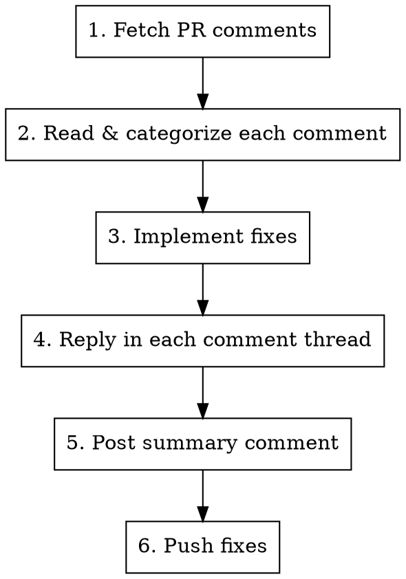

# Resolve Code Review

Read code review feedback on a pull request, resolve each item, reply in comment threads, and post a summary comment. Follows the PR conventions in CLAUDE.md.

**Complementary skill:** `superpowers:receiving-code-review` — use it alongside this one to ensure technical rigor when evaluating feedback.

## Usage

```
/resolve-code-review [PR_NUMBER]
```

If no PR number is provided, detect from the current branch with `gh pr view --json number -q .number`.

## Process



### 1. Fetch PR Comments

Detect the repo owner/name from the current git remote (do not hardcode):

```bash
REPO=$(gh repo view --json nameWithOwner -q .nameWithOwner)
```

Fetch review context:

```bash
gh pr view <PR> --repo ${REPO} --comments
gh pr diff <PR> --repo ${REPO}
```

**Fetch ALL inline comments with pagination** (default `per_page` is 30 — PRs with many review rounds will have more):

```bash
gh api "repos/${REPO}/pulls/<PR>/comments?per_page=100" \
  --jq '[.[] | {id, in_reply_to_id, line, path, body, created_at, pull_request_review_id, user: .user.login}]'
```

If the response has 100 items, there may be more pages. Use `--paginate` to get all:

```bash
gh api "repos/${REPO}/pulls/<PR>/comments" --paginate \
  --jq '[.[] | {id, in_reply_to_id, line, path, body, created_at, pull_request_review_id, user: .user.login}]'
```

**Find unreplied original comments** — original comments have `in_reply_to_id: null`. Filter out those that already have a reply from `dshaevel`:

```bash
# Get all original comment IDs (from reviewer, not replies)
ORIGINALS=$(gh api "repos/${REPO}/pulls/<PR>/comments?per_page=100" \
  --jq '[.[] | select(.in_reply_to_id == null) | select(.user.login != "dshaevel") | .id]')

# Get IDs that have been replied to by dshaevel
REPLIED=$(gh api "repos/${REPO}/pulls/<PR>/comments?per_page=100" \
  --jq '[.[] | select(.in_reply_to_id > 0) | select(.user.login == "dshaevel") | .in_reply_to_id] | unique')

# Unreplied = ORIGINALS - REPLIED (compare with jq)
```

Alternatively, fetch comments for the **latest review** specifically:

```bash
# Get the latest gemini review ID
REVIEW_ID=$(gh api "repos/${REPO}/pulls/<PR>/reviews" \
  --jq '[.[] | select(.user.login == "gemini-code-assist[bot]")] | last | .id')

# Fetch only that review's comments
gh api "repos/${REPO}/pulls/<PR>/reviews/${REVIEW_ID}/comments" \
  --jq '[.[] | {id, line, path, body, created_at}]'
```

If the review has a top-level summary comment (gemini-code-assist often posts one), read it first to understand the overall assessment.

### 2. Read and Categorize

For each review comment:
- **Read the file and surrounding code** to understand context before deciding
- **Determine severity** from the reviewer's language (critical, high, medium, low)
- **Decide resolution:** fix or decline

**Rules:**
- CRITICAL and HIGH: **Must fix**
- MEDIUM: Evaluate — fix if reasonable, decline with technical reasoning if not
- LOW: Fix if trivial, decline if YAGNI

### 3. Implement Fixes

For each item being fixed:
1. Read the relevant file
2. Make the change
3. Commit with a descriptive message (conventional commits format)

Group related fixes into a single commit when they address the same concern.

### 4. Reply to Each Comment Thread

Reply **in the comment thread** (not top-level). Every reply MUST:
- Start with `@gemini-code-assist` (required for notification)
- Explain what was fixed and how (if fixed)
- Provide technical reasoning (if declining)

```bash
gh api repos/${REPO}/pulls/<PR>/comments/<COMMENT_ID>/replies \
  -f body="@gemini-code-assist Fixed. Changed X to Y."
```

### 5. Post Summary Comment

After all items are resolved, post a top-level PR comment:

```bash
gh pr comment <PR> --body "$(cat <<'EOF'
@gemini-code-assist Review addressed:

| # | Feedback | Resolution |
|---|----------|------------|
| 1 | Issue X | Fixed in <commit> - Description of fix |
| 2 | Issue Y | Declined - Technical reasoning |
EOF
)"
```

**Resolution column format:** Include both the **commit reference** AND a **brief summary**.

### 6. Push

Push fixes to the PR branch so the reviewer can verify.

```bash
git push
```
